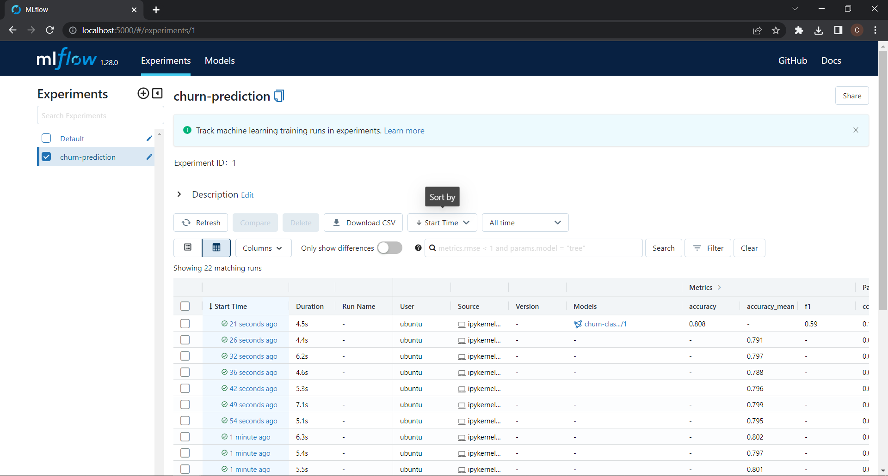
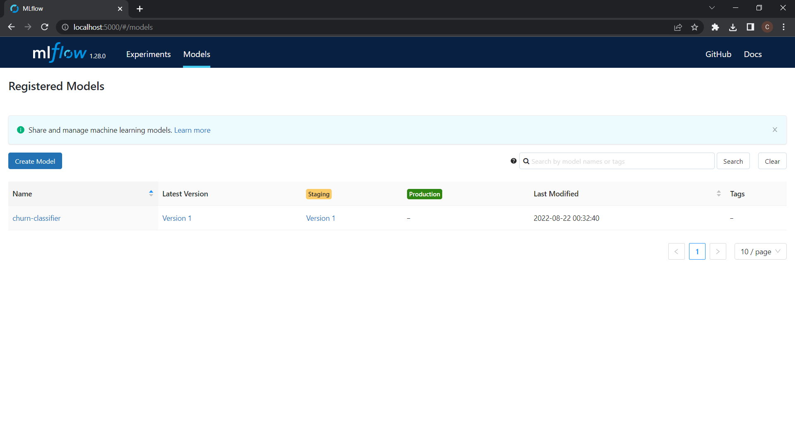

# Churn Prediction Service

Churn is defined in business terms as ‘when a client cancels a subscription to a service they have been using.’

Source: [Churn Prediction](https://www.analyticsvidhya.com/blog/2021/08/churn-prediction-commercial-use-of-data-science/)

## Objective

Predict customers behavior is important to retain customers, then the idea of this project is to build a system to predict the customer churn in the telco market(customers have signed up for: phone, internet, treaming TV, etc.) to help telco companies to detect customers with potential churn and take right decisions to retain them.

To do that, in this project a classification model for churn is built, deployed and monitored. 

**Goals:**

- Build a churn model with the "best" **accuracy**.
- Tracking model experiment with MLflow and using the registry.
- Monitor data drift with evidently and grafana integration.
- Use the cloud to develop the project.
- 

## Data Source
Each row represents a customer, each column contains customer’s attributes described on the column Metadata.

The data set includes information about:

- Customers who left within the last month – the column is called Churn
- Services that each customer has signed up for – phone, multiple lines, internet, online security, online backup, device protection, tech support, and streaming TV and movies
- Customer account information – how long they’ve been a customer, contract, payment method, paperless billing, monthly charges, and total charges
- Demographic info about customers – gender, age range, and if they have partners and dependents

Source: [Kaggle Dataset](https://www.kaggle.com/datasets/blastchar/telco-customer-churn)

## Technologies and Tools
- Cloud - [**Amazon Web Services**](https://aws.amazon.com/)
- Containerization - [**Docker**](https://www.docker.com) and [**Docker Compose**](https://docs.docker.com/compose/)
- Pre-Load Transformation - [**pandas**](https://pandas.pydata.org/)
- Model Development, Experiment Tracking, and Registration - [**scikit-learn**](https://scikit-learn.org/) and [**MLflow**](https://www.mlflow.org/)
- Model Monitoring - [**Evidently AI**](https://evidentlyai.com/), [**Grafana**](https://grafana.com/) and [**Prometheus**](https://prometheus.io/)

## Setup

### EC2 Instance

In order to reproduce the project you need to create and connect to a EC2 instance, follow the next steps:

1. **Create EC2 instance:**

    Go to EC2 service and click in launch instance(orange button), now config the VM as:
    - Name: `mlops-zoomcamp`
    - Amazon Machine Image: `Ubuntu Server 22.04 LTS (HVM), SSD Volume Type`
    - Architecture: `64-bit (x86)`
    - Instance type: `t2.large`    
    - Create or select a key pair `.pem`
    - Configure Storage: `1x 30 Gib gp2 Root Volume`.
        

2. **Copy and paste `.pem` file:** 

    When you create a key pair a `.pem` will downloaded automatically, you will have to copy and paste this file to your  `~/.ssh` directory in your local machine.
    
    
3. **Connect to VM Instance:** 

    Start the instance and go to `~./.ssh` directory and locate the `config` file type nano `~/.ssh/config` copy and paste:
    
    ```bash
    Host mlops-zoomcamp
        HostName EXTERNAL_IP
        User USER
        IdentityFile KEY_FILENAME_DIRECTORY
        LocalForward 8888 localhost:8888
        LocalForward 5000 127.0.0.1:5000
        LocalForward 3000 0.0.0.0:3000
    ```

    Just change the `EXTERNAL_IP`, `USER` and `KEY_FILENAME_DIRECTORY` with your variables.
    
Now you can type `ssh mlops-zoomcamp` in your console and you'll get connected to the VM.


### Clone Repository

Clone this repository inside EC2 instance:

```git
git clone https://github.com/Chrisroj/mlops-final-project.git
```

### Install miniconda 
The following snippet will create a directory to install miniconda into, download the latest python 3 based install script for Linux 64 bit, run the install script, delete the install script, then add a conda initialize to your bash or zsh shell. After doing this you can restart your shell and conda will be ready to go.

```bash
mkdir -p ~/miniconda3
wget https://repo.anaconda.com/miniconda/Miniconda3-latest-Linux-x86_64.sh -O ~/miniconda3/miniconda.sh
bash ~/miniconda3/miniconda.sh -b -u -p ~/miniconda3
rm -rf ~/miniconda3/miniconda.sh
~/miniconda3/bin/conda init bash
~/miniconda3/bin/conda init zsh
```

### Create a conda envinronment
Go to [1. eda_and_modeling](./1.%20eda_and_modeling/) directory and create a conda environment using the [environment.uml](./1.%20eda_and_modeling/environment.yml) typing:

```bash
conda env create -f environment.yml
```

It will create a conda environment named `churn-env`, activate the environment:

```bash
conda activate churn-env
```

### Prepare Data

Now go back to the folder root of the project where [prepare.py](./prepare.py) is located and run it:

```bash
python prepare.py
```

It will split the [churn data](./0.%20data/WA_Fn-UseC_-Telco-Customer-Churn.csv) into `train_set` and `test_set` and save them in their respective directories with the next objectives:

- `train_set`: Train the classification model and use it as `reference_file` for the evidently service.

- `test_set`: To calculate accuracy for the model and to use it for sending to the evidently service for simulate a productive environment and to monitor the data drift.

### Docker

- **Install Docker**:

```bash
sudo apt update
sudo apt install docker.io
```

- **Install Docker Compose**

```bash
mkdir soft
cd soft/
wget https://github.com/docker/compose/releases/download/v2.5.0/docker-compose-linux-x86_64 -O docker-compose
chmod +x docker-compose
```

- **Modified PATH Varibles**


   Type `cd` to return to the original directory and type ```nano .bashrc```, copy and paste the next at the end of the `.bashrc` file

```bash
export PATH="${HOME}/soft:${PATH}"
```

Type `source .bashrc`, now everything that is in `/soft` directory will be in the PATH then you can execute it everywhere.

- **Add current user to docker group**

```bash
sudo usermod -aG docker $USER
logout
```

Then logback to the VM.

## Reproduce EDA and Modeling Phase

Go to the [1. eda_and_modeling](./1.%20eda_and_modeling/) directory open jupyter lab:

```bash
jupyter lab
```

Run the [exploratory_data_analysis](./1.%20eda_and_modeling/exploratory_data_analysis.ipynb) notebook:

- We identify empty strings in `TotalCharges` then they were replaced with "0" and after change strings to float data type.

- We identify that the target is a string then we have to change it to a numerica value.

Now type in the terminal(in the [1. eda_and_modeling](./1.%20eda_and_modeling/) directory):
```bash
mlflow ui --backend-store-uri sqlite:///mlflow.db
```
And run the [trainning_churn_model](./1.%20eda_and_modeling/trainning_churn_model.ipynb). This notebook build a scikit-learn pipeline to train a Random Forest Classfier and uses MLflow to track the experiments and register the best model, go to [localhost:5000](localhost:5000) to see all the runs in MLflow:



You can check the registered models too:



In the last run it can be seen the accuracy in the test set:

- **accuracy test set:** 0.808

## Reproduce Monitoring Service
To reproduce this section you can stop all the services started in the last section

To start all required services to reproduce monitoring service go to [2. monitoring service](./2.%20monitoring_service/) directory and execute:

```bash
docker-compose up
```


borrar mlruns y mldb


Cosas a mejorar:
- Usar el mismo environment para el eda, entrenamiento y la de web service
-  Poner preprocesamiento de target de churn(cuando cambio yes por 1 y no por 0) en otro script(tal vez el de send_data o evidently_service).
- utilizar pipfile en evidently service y en docker-compose. Solo utilicé pipfile in prediction service
- Usar terraform

# Que mi proximo sea de predicción de bicis de la cdmx
phase1-> results
phase2-> results

poner table of contents